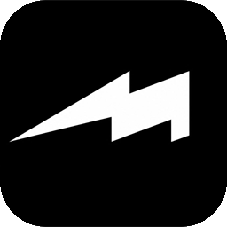
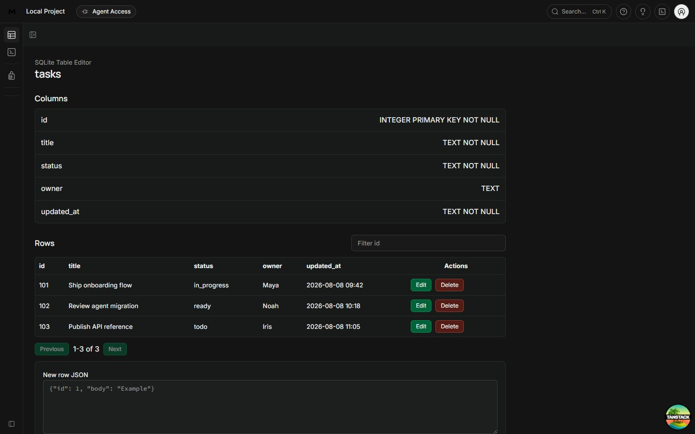
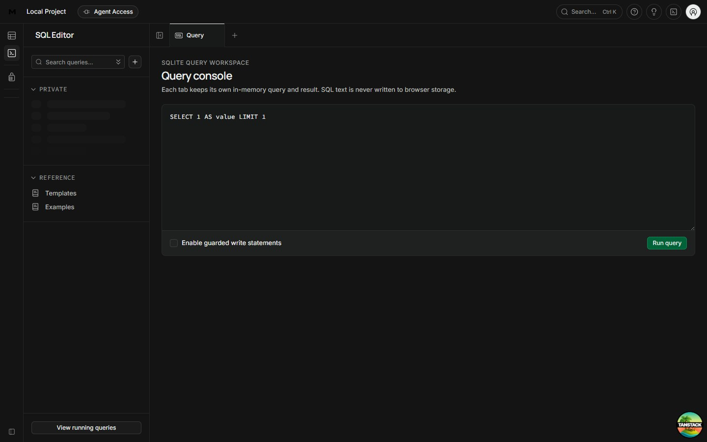
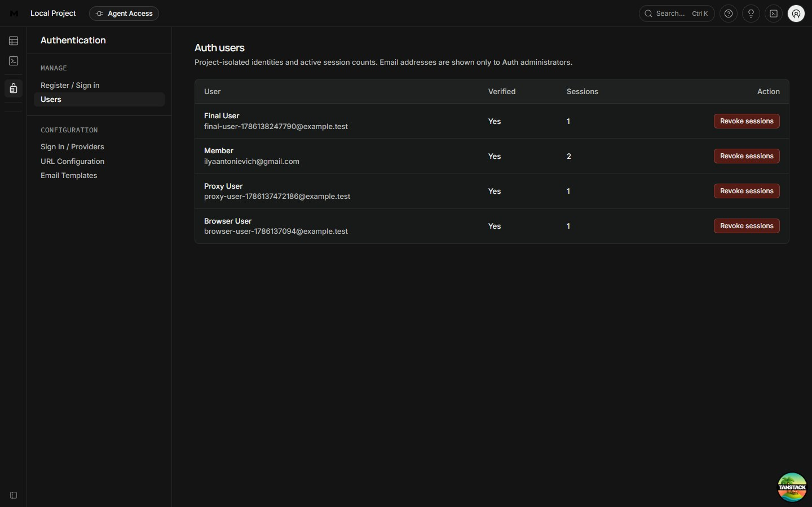
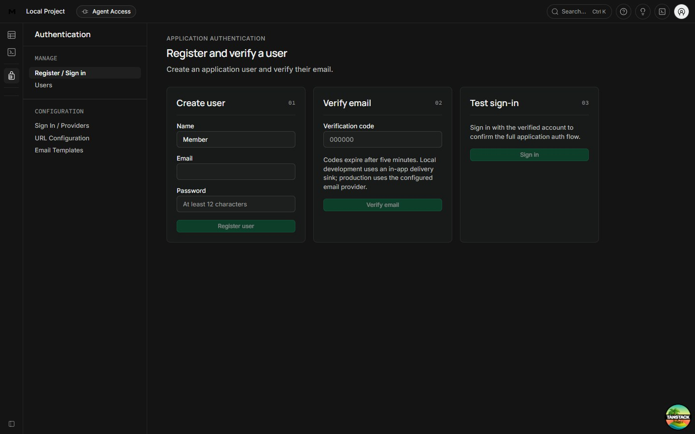
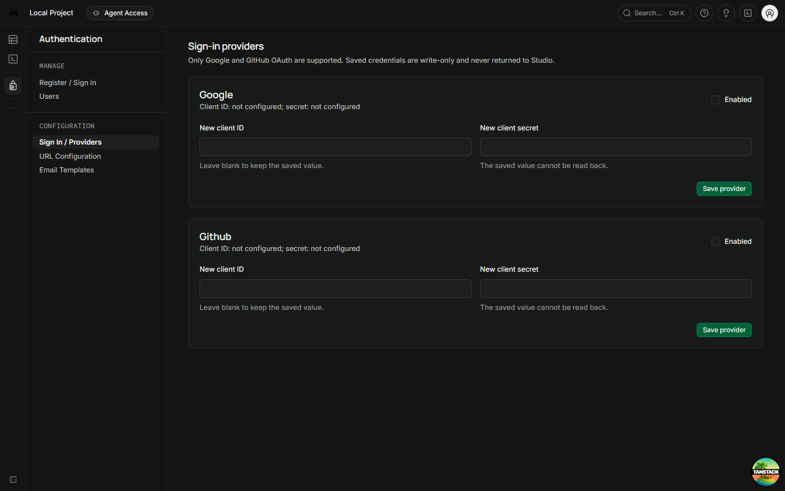

<div align="center">
  

  # Mekka

  **THE BACKEND THAT DOESN'T NEED A FLEET.**

  A lightweight Supabase alternative built around Bun, SQLite, and safe access for AI agents.

  [](https://github.com/yiaany/mekka/actions/workflows/ci.yml)
  
  
  
  
  
</div>

Mekka gives you the parts of a backend platform that most applications actually use:

- a SQLite database with a typed Data API;
- authentication and user management;
- local and S3-compatible object storage;
- Realtime changes, Broadcast, and Presence;
- database previews and guarded migrations;
- an embedded Studio;
- scoped MCP access for AI agents.

Everything runs locally with one command:

```bash
npx mekka
```

Open `http://127.0.0.1:8082` when the command finishes.

<p align="center">
  
</p>

## Documentation

Start with the guides and compatibility notes included in this repository:

- [Data API compatibility](apps/gateway/SUPABASE_DATA_COMPATIBILITY.md)
- [Gateway compatibility](apps/gateway/COMPATIBILITY.md)
- [SQLite management API](apps/sqlite-meta/COMPATIBILITY.md)
- [Realtime protocol](docs/realtime-protocol-matrix.md)
- [Core capability matrix](docs/core-capability-matrix.md)
- [Backup and restore](docs/runbooks/sqlite-backup-restore.md)
- [MCP integration](docs/integrations/mcp.md)
- [Security policy](SECURITY.md)

## Getting Started

You need Node.js 20 or newer. The CLI installs Bun when needed, downloads Mekka, installs the
workspace, builds the required packages, and starts the local services.

```bash
npx mekka
```

To choose the destination directory:

```bash
npx mekka my-app
```

Git is optional. When Git is unavailable, the CLI downloads the repository archive over HTTPS.

For development inside an existing checkout:

```bash
bun install --frozen-lockfile
bun run dev
```

The local stack uses two addresses:

| Service | Address |
| --- | --- |
| Studio | `http://127.0.0.1:8082` |
| Backend | `http://127.0.0.1:3001` |

Local data is stored in `apps/studio/.local/`.

## Features

### Database

Mekka currently uses SQLite through Bun's native driver. The database layer supports typed reads and
mutations, tables, columns, indexes, schema hashes, migrations, checkpoints, backup, and restore.

The public Data API implements a tested subset of `supabase-js` and PostgREST behavior. It supports
selects, filters, ordering, pagination, inserts, updates, deletes, primary-key upserts, exact counts,
and bounded bulk writes.

Mekka does not claim PostgreSQL compatibility where it does not exist. PostgreSQL arrays, ranges,
native RLS, arbitrary extensions, RPC, casts, and the full PostgREST surface are not supported today.

### Auth

Auth includes sessions, JWT/JWKS, email verification, password reset, OAuth providers, refresh-token
rotation, administrative user management, and audit records.

Agent tokens are tied to the originating application session. Logging out, resetting a password, or
revoking that session also revokes its Agent Access.

### Storage

Object storage works with the local filesystem or an S3-compatible provider. The current API includes
buckets, signed reads, checksums, bounded downloads, resumable uploads, quotas, and reconciliation.

Object metadata is tenant-scoped. Reads verify the provider key, size, and SHA-256 checksum before the
body is returned.

### Realtime

Trusted mutations write their row changes and Realtime events in the same database transaction.
Subscriptions use an at-least-once cursor model with acknowledgements and replay after reconnect.

Mekka also supports private channels, Broadcast, and Presence. Slow consumers, message sizes,
connection counts, and pending deliveries are bounded.

### Studio

Studio provides screens for tables, SQL, Auth users, Auth providers, Storage, Agent Access, and
production approvals.

<table>
  <tr>
    <td width="50%"></td>
    <td width="50%"></td>
  </tr>
  <tr>
    <td width="50%"></td>
    <td width="50%"></td>
  </tr>
</table>

Studio contains code derived from Supabase Studio under Apache License 2.0. See
[`apps/studio/UPSTREAM.md`](apps/studio/UPSTREAM.md) and
[`apps/studio/UPSTREAM_LICENSE`](apps/studio/UPSTREAM_LICENSE) for provenance and license details.

## Agent Access

AI agents are useful, but a production database password is not a permission model.

Mekka issues short-lived, tenant-scoped MCP tokens. Read access is the default. Write access creates a
disposable preview database where the agent can prepare and validate a migration.

```text
Agent
  -> scoped token
  -> preview database
  -> validation
  -> exact SQL approval
  -> production promotion
```

The approval is bound to the migration artifact and can be consumed once. Production promotion checks
the expected schema again before applying the change.

<details>
<summary><strong>MCP configuration</strong></summary>

```json
{
  "mcpServers": {
    "mekka": {
      "type": "http",
      "url": "https://mekka.example.com/mcp",
      "headers": {
        "Authorization": "Bearer <temporary-agent-access-token>"
      }
    }
  }
}
```

</details>

## How It Works

Every request is bound to an organization, project, environment, branch, and generation. The backend
authenticates the caller, checks the requested capability, validates the schema and policy, and only
then executes a prepared statement.

```text
Client / Studio / MCP
          |
          v
Authentication and limits
          |
          v
Tenant capability check
          |
          v
Query or migration validation
          |
          v
Prepared SQLite statement
          |
          v
Result, audit, and metrics
```

The main rules are straightforward:

- user values are always bound parameters;
- identifiers are resolved through schema metadata;
- tenant checks use the complete tenant identity;
- requests, results, uploads, and queues have limits;
- mutations use durable idempotency;
- unsupported operations fail with an explicit error;
- secrets and SQL values are not written to logs.

## Project Structure

Mekka is a Bun workspace. The main services and packages are:

```text
apps/
  gateway/             Data, Storage, Realtime, and compatibility routes
  health-service/      Health service example
  mcp/                 MCP resources, tools, and mutation workflow
  sqlite-meta/         Database management, Auth, branches, and approvals
  studio/              Studio and production web server

packages/
  auth-core/           Sessions, JWT/JWKS, OAuth, and token rotation
  branch-core/         Preview databases and guarded promotion
  migration-engine/    Migration artifacts, checkpoints, and restore
  policy-engine/       Row and field authorization
  protocol/            Tenant identity, capabilities, and errors
  query-ast/           Validated Data API queries
  realtime-core/       Changefeeds, channels, Broadcast, and Presence
  schema-manifest/     SQLite schema contracts
  sqlite-compiler/     Prepared SQLite statement compiler
  storage-core/        Database adapter and object storage
  studio-domain-sdk/   Typed Studio API client
```

## Roadmap

SQLite is the current engine. libSQL/Turso is next, followed by PGlite.

The libSQL work will add remote databases, local replicated reads, primary write routing, managed
preview databases, and scoped credentials. PGlite will add a PostgreSQL-compatible option for JSONB,
pgvector, and isolated preview workloads.

These features are planned and are not part of the current release. They will be marked as supported
only after they pass the same storage, migration, branch, security, and failure tests as SQLite.

> **Supabase-scale usefulness. A fraction of the machinery.**

## Self-Hosting

Build the repository before starting the production process:

```bash
bun run build

MEKKA_STUDIO_ACCESS_TOKEN="replace-with-a-random-token" \
MEKKA_AUTH_SESSION_SECRET="replace-with-a-random-secret" \
MEKKA_PUBLIC_URL="https://mekka.example.com" \
NEXT_PUBLIC_SITE_URL="https://mekka.example.com" \
SQLITE_META_DATA_DIRECTORY="/absolute/path/to/mekka-data" \
bun run --cwd apps/studio start:production
```

The backend remains on loopback. Put a trusted TLS reverse proxy in front of Studio and persist the
data directory. Backups are only useful after a restore has been tested.

Docker builds are also supported:

```bash
docker build \
  --build-arg NEXT_PUBLIC_SITE_URL=https://mekka.example.com \
  --build-arg NEXT_PUBLIC_MEKKA_GATEWAY_URL=https://mekka.example.com \
  -f apps/studio/Dockerfile \
  -t mekka-studio .
```

## Development

The complete repository gate is:

```bash
bun run check
```

Individual commands are available when working on a smaller change:

| Command | Purpose |
| --- | --- |
| `bun run dev` | Start Studio and the backend |
| `bun run test` | Run the core Bun tests |
| `bun run test:workspaces` | Run workspace test suites |
| `bun run test:studio:fork` | Run Studio integration tests |
| `bun run lint` | Run Biome lint checks |
| `bun run typecheck` | Typecheck core packages |
| `bun run typecheck:studio` | Typecheck Studio |
| `bun run build` | Build packages and Studio |
| `bun run smoke:studio:production` | Test the production Studio path |
| `bun audit` | Check dependency advisories |

See [`CONTRIBUTING.md`](CONTRIBUTING.md) before opening a pull request.

## Support

- Use GitHub Issues for reproducible bugs, questions, and feature requests.
- Report security problems privately as described in [`SECURITY.md`](SECURITY.md).

Mekka is under active development. Passing tests cover the paths that have been reviewed, not every
possible deployment. Production users should add monitoring, backup verification, and an independent
security review.

## License

Mekka is available under the **Mekka Business License 2.0**. Individuals may inspect, modify, test,
and learn from the source. Qualifying small organizations may use Mekka in their own products under
the additional license grant.

The license does not permit a large company or cloud provider to repackage Mekka as a competing hosted
backend without a commercial agreement.

See [`LICENSE.md`](LICENSE.md) for the complete terms.
