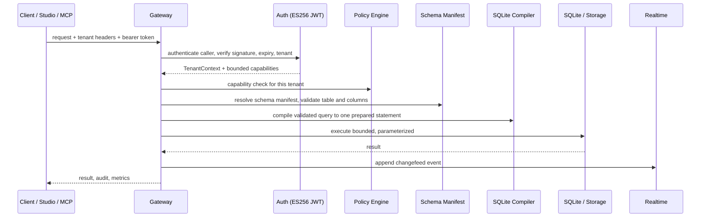

<div align="center">
  
</div>

<div align="center">

# Mekka

**KEEP THE BACKEND. FIRE THE FLEET.**

Database · Auth · Storage · Realtime · Studio · safe agent access. One Bun project, one SQLite file.

[](https://github.com/yiaany/mekka/actions/workflows/ci.yml)


```
npx mekka
```
downloads, installs, builds, starts the backend, and opens Studio at `http://127.0.0.1:8082`.

&nbsp;·&nbsp; [Run it](#run-it) &nbsp;·&nbsp; [Request path](#request-path) &nbsp;·&nbsp; [What's inside](#whats-inside) &nbsp;·&nbsp; [Agent access](#agent-access) &nbsp;·&nbsp; [API surface](#api-surface) &nbsp;·&nbsp; [Security](#security) &nbsp;·&nbsp; [Compare](#how-it-compares) &nbsp;·&nbsp; [License](#license)

</div>

<p align="center">✦ &nbsp;✦ &nbsp;✦</p>

## Why Mekka exists

Supabase taught the market to expect a database, Auth, Storage, Realtime, and a dashboard in the same box. Mekka keeps that product shape and cuts the infrastructure bill underneath it. The current release runs on Bun and SQLite. The database is a file you own. Studio ships in the repo. You can trace the request path without drawing a map of twelve services first.

Every request carries the full tenant identity, and every user value stays a prepared-statement parameter. That's the contract:

| Concern | Bound into each request |
| --- | --- |
| Who is calling | An authed caller with a capability set; the tenant tuple must match the headers exactly |
| Where data can go | One organization, project, environment, branch, generation |
| What it can touch | Type-resolved tables and columns from the schema manifest |
| How big it can be | Row cap, request byte cap, response byte cap, object cap, timeouts |
| Replay safety | SHA-256 fingerprint and reusable idempotency keys |
| Writes from agents | Disposable preview branch, then one-time human-approved promotion |

Deep PostgreSQL compatibility still belongs on PostgreSQL. Mekka rejects unsupported behavior instead of faking it. Teams that need native RLS, stored procedures, ranges, or a large extension catalog should use the real thing. Everyone else has been paying a Postgres tax for features their app never touches.

> **Mekka is coming for the teams that want Supabase's product and none of its weight.**

<p align="center">✦ &nbsp;✦ &nbsp;✦</p>

## Request path

<div align="center">



</div>

Auth happens before permissions. The backend resolves table and column names through the schema manifest, binds user values as parameters, applies policy, and executes one prepared statement. It never parses user SQL directly: the constrained query dialect becomes an AST first, then a compiled statement, then a bounded execution.

Mutations carry idempotency keys. Payloads, results, uploads, queues, and Realtime buffers have hard limits. Unsupported operations return an explicit error instead of an approximation. Errors don't carry secrets, SQL values, or stack traces.

<details>
<summary><strong>The local backend stays on loopback.</strong> Click for the deployment shape.</summary>

The default backend binds `127.0.0.1:3001`, Studio serves `127.0.0.1:8082`. Put a trusted TLS reverse proxy in front of Studio, persist the data directory, and run a restore before trusting a backup.

```bash
bun run build

MEKKA_STUDIO_ACCESS_TOKEN="replace-with-a-random-token" \
MEKKA_AUTH_SESSION_SECRET="replace-with-a-random-secret" \
MEKKA_PUBLIC_URL="https://mekka.example.com" \
NEXT_PUBLIC_SITE_URL="https://mekka.example.com" \
SQLITE_META_DATA_DIRECTORY="/absolute/path/to/mekka-data" \
bun run --cwd apps/studio start:production
```

Docker builds are available:

```bash
docker build \
  --build-arg NEXT_PUBLIC_SITE_URL=https://mekka.example.com \
  --build-arg NEXT_PUBLIC_MEKKA_GATEWAY_URL=https://mekka.example.com \
  -f apps/studio/Dockerfile \
  -t mekka-studio .
```

</details>

<p align="center">✦ &nbsp;✦ &nbsp;✦</p>

## What's inside

Each subsystem ships in the repo and works against the same local project. Open any of them to see what it actually does.

<details>
<summary><strong>Database</strong> — typed reads and writes on a file you own</summary>

- Tables, columns, indexes, migrations, schema hashes, checkpoints, backup, and restore
- Tables and columns resolve through a versioned schema manifest; values always bind as parameters
- Reads compile to one prepared statement, bounded by row, byte, and timeout caps
- Writes are idempotent via a SHA-256 fingerprint and reusable keys
</details>

<details>
<summary><strong>Auth</strong> — sessions, JWT/JWKS, email OTP, OAuth</summary>

- `better-auth` with email OTP, password reset, and sessions
- ES256 access tokens with a published JWKS and a short expiry; verifier applies clock tolerance
- HttpOnly session cookie with rotating refresh
- Google and GitHub OAuth, plus a local verification-code endpoint for development
</details>

<details>
<summary><strong>Storage</strong> — local or S3-compatible, with signed reads</summary>

- Local filesystem and S3-compatible object providers behind one interface
- Checked checksums, bounded reads, signed read grants with TTL, and reconciliation
- Resumable upload subset with leases and cleanup
- Quotas per bucket and per object, MIME allowlist, and normalized safe paths
</details>

<details>
<summary><strong>Realtime</strong> — changefeeds, channels, Broadcast, Presence</summary>

- Transactional SQLite journal drives changefeeds with a resume cursor and ack
- Policy-projected delivery: subscribers only see rows their policy allows
- Private channels, Broadcast, and Presence in one Bun runtime
- Bounded socket payloads and an idle timeout
</details>

<details>
<summary><strong>Branches</strong> — disposable previews, guarded promotion</summary>

- Short-lived preview branches with their own Auth and credential lifecycle
- One validated migration per preview lifecycle, schema-CAS promotion, and restore points
- Durable retries and TTL cleanup of stale previews
</details>

<details>
<summary><strong>Studio</strong> — tables, SQL, users, providers, files, approvals</summary>

- Tables, SQL editor, users, Auth providers, files, agent grants, previews, and approvals
- The SQL editor runs one restricted statement, blocks system tables, and enforces LIMITs
- Screenshots below come from the current project, not a design mockup
</details>

<details>
<summary><strong>Agent Access</strong> — scoped MCP tokens, preview-bound writes</summary>

- One-hour tokens bound to a single tenant tuple and application session
- Read access works immediately; writes open a disposable preview branch
- Migration, validation, Studio approval, then one-time production promotion
</details>

<details>
<summary><strong>Supabase compatibility</strong> — a tested `supabase-js` data subset</summary>

- Common CRUD flows against the pinned `supabase-js` release, verified by a differential harness
- `select`, filters, `order`, `limit`, `range`, exact `count`, `insert`, `update`, `delete`, `upsert`
- Everything else (arrays, ranges, RLS, RPC, casts, FTS) fails explicitly; it is never approximated

Read the exact contracts:
[Data API](apps/gateway/SUPABASE_DATA_COMPATIBILITY.md) ·
[Gateway](apps/gateway/COMPATIBILITY.md) ·
[SQLite meta](apps/sqlite-meta/COMPATIBILITY.md) ·
[Realtime protocol](docs/realtime-protocol-matrix.md) ·
[Core matrix](docs/core-capability-matrix.md)
</details>

<p align="center">✦ &nbsp;✦ &nbsp;✦</p>

## Product tour

<div align="center">

| | |
| --- | --- |
|  |  |
|  |  |
|  |  |

</div>

Studio contains code derived from Supabase Studio under Apache License 2.0. Provenance and the reproduced license live in [`apps/studio/UPSTREAM.md`](apps/studio/UPSTREAM.md) and [`apps/studio/UPSTREAM_LICENSE`](apps/studio/UPSTREAM_LICENSE).

<p align="center">✦ &nbsp;✦ &nbsp;✦</p>

## Agent access without production roulette

An AI agent should not need your production database password. Mekka gives it a short-lived token bound to one organization, project, environment, branch, generation, and application session. Read access works immediately. Write access opens a disposable preview.

```text
Agent
  → one-hour scoped token
  → isolated preview branch
  → migration and validation
  → exact SQL approval in Studio
  → one-time production promotion
```

Mekka stores the migration artifact, SQL, schema hashes, and the destructive-operation flag. Studio shows the change before approval. The approval secret works once and only for that artifact. Promotion checks the production schema again before it runs. The agent can break its preview; production stays behind a human decision and a schema check.

<details>
<summary><strong>The MCP surface is deliberately small.</strong> Click to open the full tool list.</summary>

| Kind | Name | What it does |
| --- | --- | --- |
| Resource | `schema://current` | Current schema manifest |
| Resource | `schema://branch/{branchId}` | Schema for the matching branch only |
| Resource | `policies://current` | Sanitized policy summary, no executable predicates |
| Resource | `migrations://history` | Migration metadata, no SQL text |
| Resource | `logs://recent` | Log metadata, message text marked untrusted |
| Resource | `capabilities://session` | Capabilities active for this session |
| Tool | `inspect_schema` | Read the branch schema manifest |
| Tool | `explain_query` | Compile a constrained read query without executing it |
| Tool | `list_migrations` | Applied migration metadata |
| Tool | `get_policy_summary` | Sanitized policy summary |
| Tool | `create_preview_branch` | Short-lived isolated preview from the parent |
| Tool | `propose_migration` | Record a branch-bound migration plan, no DDL applied |
| Tool | `apply_to_preview` | Apply the proposal to its exact preview only |
| Tool | `validate_changes` | Validate the applied preview migration |
| Tool | `request_promotion` | Ask Studio for approval, then step up |

There is no direct production-write tool, no arbitrary SQL, no row-data access, no credential or token passthrough. Each tool is gated by a separate capability: `mcp:read`, `mcp:preview:create`, `mcp:preview:propose`, `mcp:preview:apply`, `mcp:preview:validate`, `mcp:promotion:request`.

</details>

<details>
<summary><strong>MCP configuration.</strong> Click to copy.</summary>

```json
{
  "mcpServers": {
    "mekka": {
      "type": "http",
      "url": "https://mekka.example.com/mcp",
      "headers": {
        "Authorization": "Bearer <temporary-agent-access-token>"
      }
    }
  }
}
```

For a local MCP server that bridges stdio to the remote Streamable HTTP endpoint:

```bash
npx mekka mcp-stdio --url https://mekka.example.com/mcp --token-env MEKKA_MCP_TOKEN
```

</details>

<p align="center">✦ &nbsp;✦ &nbsp;✦</p>

## API surface

Every request gates on the tenant tuple `organization / project / environment / branch / generation`.

<details>
<summary><strong>Data API</strong> — policy-authorized REST, plus a Supabase subset</summary>

| Method | Path | Notes |
| --- | --- | --- |
| GET/POST/PATCH/DELETE | `/rest/v1/:table` | Policy-authorized select and mutate |
| ALL | `/mcp` | MCP Streamable HTTP endpoint |
| GET | `/openapi.json` | Static OpenAPI 3.1 document |

Supported from `supabase-js`: `select`, `eq`/`neq`/`gt`/`gte`/`lt`/`lte`/`in`/`is`/`not`/`or`/`match`, `order`, `limit`, `range`, exact `count`, `insert`, `update`, `delete`, `upsert` (primary key only, merge duplicates only). Embedding, aliases, casts, RPC, arrays, ranges, and full-text search fail explicitly.

</details>

<details>
<summary><strong>Storage</strong> — buckets, objects, signed grants, resumable uploads</summary>

| Method | Path | Notes |
| --- | --- | --- |
| GET/POST/PATCH/DELETE | `/storage/v1/buckets` | List, create, read, update, delete |
| GET/PUT/DELETE | `/storage/v1/object/:bucket/*` | List, upload, download, delete |
| POST | `/storage/v1/object/sign/:bucket/*` | Issue a signed read grant |
| GET | `/storage/v1/signed/:bucket/*` | Redeem a signed grant |
| POST/HEAD/PATCH/DELETE | `/storage/v1/resumable/:uploadId` | Resumable upload subset with leases |

Local filesystem and S3-compatible providers, checksummed bounded reads, MIME allowlisting, quotas, and reconciliation. Full TUS, transforms, and multipart uploads are not claimed.

</details>

<details>
<summary><strong>Realtime</strong> — WebSocket changefeeds, Broadcast, Presence</summary>

| Surface | Notes |
| --- | --- |
| WebSocket | `/realtime/v1/websocket`, idle timeout, bounded payload |
| Changefeeds | Transactional SQLite journal, resume cursor, policy-projected delivery |
| Channels | Private channels, Broadcast, Presence |

</details>

<details>
<summary><strong>Schema, Auth, and agent endpoints</strong> — the local backend</summary>

| Method | Path | Capability |
| --- | --- | --- |
| GET | `/tables`, `/tables/:table` | `schema:read` |
| GET | `/rows/:table` | `data:read`, filtered, paginated |
| POST/PATCH/DELETE | `/rows/:table` | `data:write`, idempotent |
| POST | `/sql` | One restricted statement |
| POST/PATCH/DELETE | `/tables`, `/tables/:table` | `schema:manage`, checkpointed |
| GET/POST | `/columns`, `/indexes` | Schema read and manage |
| GET | `/schema/health` | Format, schema version, schema hash |
| ALL | `/auth/*` | Local auth |
| POST | `/auth-local/agent-token` | Issue an Agent Access token |
| GET/PATCH | `/mcp-admin/approvals` | Review and decide approvals |
| ALL | `/mcp` | MCP endpoint |

</details>

<p align="center">✦ &nbsp;✦ &nbsp;✦</p>

## Security model

<details>
<summary><strong>Boundaries, not a promise of perfection.</strong> Click to open.</summary>

| Boundary | What Mekka does |
| --- | --- |
| Tenant isolation | Exact five-part tuple in headers or signed-url query params; mismatch fails before policy |
| Access tokens | ES256 JWT, JWKS exposed, clock tolerance and short expiry applied |
| Sessions | HttpOnly cookie, refresh that rotates |
| Auth | `better-auth` with email OTP, password reset, Google and GitHub OAuth |
| Injection | User values always prepared-statement parameters, never interpolated |
| Replay | SHA-256 request fingerprint, reusable idempotency keys, conflict on reuse with a different body |
| Agent writes | Preview branch only, schema CAS on promotion, one-time approval, no production SQL tool |
| MCP | No credential or token passthrough, no row data, logs and prompts marked untrusted |
| Storage | Signed read grants with TTL, checksums, bounded objects, resumable leases with cleanup |
| Errors | No secrets, SQL values, or stack traces; stable category codes |
| Infrastructure | Backend stays on loopback behind a TLS reverse proxy; secrets mounted at runtime |

Security research is welcome. Source access makes review possible; it doesn't prove the absence of vulnerabilities.

</details>

<p align="center">✦ &nbsp;✦ &nbsp;✦</p>

## How it compares

| | Mekka | Supabase | DIY on Postgres |
| --- | --- | --- | --- |
| Auth, Storage, Realtime, dashboard in one box | Yes | Yes | You build it |
| Runs on one process, one file | Yes, Bun + SQLite | No, a fleet of services | No, a stack of containers |
| Safe agent writes via preview branches | Yes, scoped tokens + approval | Some branch support | You build it |
| Prompt- and tool-driven changes stay off production | Yes, single Studio approval | Partial | You build it |
| Supabase-js data subset for common CRUD | Yes, tested | Native | You write the adapter |
| Works against a checked-out repo offline | Yes | No | No |
| Native Postgres RLS, RPC, extensions | No, explicit error | Yes | Yes |
| Local infrastructure cost | One Bun process | Cloud services | Containers, ops |

<p align="center">✦ &nbsp;✦ &nbsp;✦</p>

## Run it

Install Node.js 20 or newer, then:

```bash
npx mekka my-app
```

Pass a folder name if the default `mekka` directory is taken. The CLI installs Bun when needed. Git is optional; without it, Mekka downloads the GitHub archive over HTTPS and enforces caps on archive size, extracted bytes, and entry count.

Inside an existing checkout:

```bash
bun install --frozen-lockfile
bun run dev
```

| Service | Address |
| --- | --- |
| Studio | `http://127.0.0.1:8082` |
| Backend | `http://127.0.0.1:3001` |

Local state stays in `apps/studio/.local/`.

<p align="center">✦ &nbsp;✦ &nbsp;✦</p>

## Verification and development

`bun run check` runs the full gate: formatting, lint, typecheck (core and Studio), the CLI suite, workspace tests, Studio tests, the production build, and smoke tests.

<details>
<summary><strong>Development commands.</strong> Click to expand.</summary>

| Command | Purpose |
| --- | --- |
| `bun run dev` | Build the Studio SPA, then start the low-memory Studio and backend runtime |
| `bun run --cwd apps/studio dev:hmr` | Start the memory-heavier Vite HMR server for Studio development |
| `bun run test` | Run the core Bun tests |
| `bun run test:workspaces` | Run workspace test suites |
| `bun run test:studio:fork` | Run Studio integration tests |
| `bun run lint` | Run Biome lint checks |
| `bun run typecheck` | Typecheck core packages |
| `bun run typecheck:studio` | Typecheck Studio |
| `bun run build` | Build packages and Studio |
| `bun run smoke:studio:production` | Test the production Studio path |
| `bun run smoke:health` | Test the health service |
| `bun audit` | Check dependency advisories |

</details>

Read [`CONTRIBUTING.md`](CONTRIBUTING.md) before opening a pull request.

<p align="center">✦ &nbsp;✦ &nbsp;✦</p>

## Roadmap

<details>
<summary><strong>What ships today, and what is still being built.</strong> Click to open.</summary>

| Ready now | Still being built |
| --- | --- |
| SQLite engine with a typed Data API | libSQL/Turso remote databases and embedded replicas |
| Auth: sessions, JWT/JWKS, OAuth, refresh | PGlite isolated runtimes, JSONB, pgvector |
| Storage: local and S3 providers, signed grants | Managed preview databases and primary write routing |
| Realtime changefeeds, Broadcast, Presence | Distributed Realtime coordinator |
| Preview branches with guarded promotion | Divergent data merge and multiple dependent migrations |
| Scoped agent access with Studio approvals | Embedded OAuth issuer for MCP |
| Studio, SQL editor, users, providers, files | Functions provisioning and an edge runtime |
| Supabase-js data subset, tested | Full PostgREST parity items |
| Health service and smoke suite | Production monitoring, backup drills, incident runbooks |

Mekka is ready for a controlled local deployment with test data. The engine track through libSQL and PGlite has to land and pass its storage, migration, branch, security, and failure tests before it absorbs a paid cloud's production workload.

</details>

<p align="center">✦ &nbsp;✦ &nbsp;✦</p>

## Repository map

| Path | Purpose |
| --- | --- |
| `apps/gateway` | Data, Storage, Realtime, compatibility, MCP mount |
| `apps/sqlite-meta` | Database management, Auth, branches, approvals, local MCP |
| `apps/mcp` | Agent resources, tools, and mutation workflow |
| `apps/studio` | Studio and production web server |
| `apps/health-service` | Health check example |
| `packages/auth-core` | Sessions, JWT/JWKS, OAuth, token rotation |
| `packages/storage-core` | Database adapter and object storage |
| `packages/realtime-core` | Changefeeds, channels, Broadcast, Presence |
| `packages/branch-core` | Preview lifecycle and guarded promotion |
| `packages/migration-engine` | Migration artifacts, checkpoints, restore |
| `packages/policy-engine` | Row and field authorization |
| `packages/schema-manifest` | SQLite schema contracts |
| `packages/sqlite-compiler` | Prepared SQLite statement compiler |
| `packages/query-ast` | Validated Data API queries |
| `packages/protocol` | Tenant identity, capabilities, errors |
| `packages/studio-domain-sdk` | Typed Studio API client |
| `packages/mekka-cli` | The `npx mekka` launcher and `mcp-stdio` bridge |
| `packages/onboarding-core` | Project provisioning and connect analyzer |
| `apps/studio/UPSTREAM.md` | Supabase Studio provenance |

<p align="center">✦ &nbsp;✦ &nbsp;✦</p>

## Support and security

Use GitHub Issues for reproducible bugs, questions, and feature requests. Report vulnerabilities privately through the process in [`SECURITY.md`](SECURITY.md).

Mekka is under active development. Reviewed paths have tests. A production deployment still needs monitoring, verified backups, deployment hardening, and an independent security review.

<p align="center">✦ &nbsp;✦ &nbsp;✦</p>

## License

<details>
<summary><strong>Mekka Business License 2.0.</strong> Click to read the plain-language terms.</summary>

Individuals may inspect, modify, test, and learn from the source. Qualifying small organizations may use Mekka in their products under the additional grant.

Large companies and cloud providers may not repackage Mekka as a competing hosted backend without a commercial agreement. [`LICENSE.md`](LICENSE.md) contains the terms.

</details>

<div align="center">

> **WE'RE BUILDING THE REASON TO LEAVE SUPABASE.**

</div>