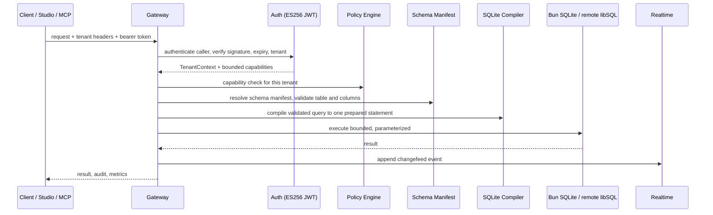

<div align="center">
  
</div>

<div align="center">

# Mekka

**KEEP THE BACKEND. FIRE THE FLEET.**

Database · Auth · Storage · Realtime · Studio · safe agent access. Local SQLite or remote libSQL, one product surface.

[](https://github.com/yiaany/Mekka/actions/workflows/ci.yml)


```
npx mekka
```
downloads, installs, builds, starts the backend, and opens Studio at `http://127.0.0.1:8082`.

&nbsp;·&nbsp; [What runs today](#what-runs-today) &nbsp;·&nbsp; [Run it](#run-it) &nbsp;·&nbsp; [Request path](#request-path) &nbsp;·&nbsp; [What's inside](#whats-inside) &nbsp;·&nbsp; [Agent access](#agent-access-without-production-roulette) &nbsp;·&nbsp; [API surface](#api-surface) &nbsp;·&nbsp; [Security](#security-model) &nbsp;·&nbsp; [Compare](#how-it-compares) &nbsp;·&nbsp; [License](#license)

</div>

## Why Mekka exists

Supabase taught the market to expect a database, Auth, Storage, Realtime, and a dashboard in the same box. Mekka keeps that product shape without requiring a fleet of services for the core workflow. The current release runs on Bun and supports two SQLite-compatible data profiles: a local Bun SQLite database for development and an authenticated remote libSQL primary for self-hosted deployments. Studio, Auth, policy, migrations, and MCP ship in the same repository.

## What runs today

| Surface | Local profile | Self-hosted libSQL profile |
| --- | --- | --- |
| User data | Bun SQLite in the project data directory | Authenticated remote libSQL over HTTPS |
| Studio | Table Editor, restricted SQL Editor, Authentication, Agent Access | The same supported Studio surface; unsupported upstream routes redirect away |
| Schema and rows | Manifest-backed table, column, index, row, and restricted SQL APIs | The same contracts through the selected remote engine; no local user-data fallback |
| MCP metadata | `inspect_schema`, migrations, policy summary, constrained query explanation | The same tools against remote libSQL |
| MCP row data | Explicit opt-in `query_rows` with `mcp:data:read` | Explicit opt-in `query_rows` against remote libSQL |
| Agent writes | Isolated local preview, validation, Studio approval, guarded promotion | Typed `unsupported`; self-hosted libSQL previews are not faked locally |
| Control plane | Local SQLite stores for Auth, sessions, grants, approvals, and audit state | The same local control plane; database credentials remain server-side |

The remote profile does not silently fall back to a project `.sqlite` file. If libSQL authentication, routing, or policy resolution fails, the request fails.

Every request carries the full tenant identity, and every user value stays a prepared-statement parameter. That's the contract:

| Concern | Bound into each request |
| --- | --- |
| Who is calling | An authed caller with a capability set; the tenant tuple must match the headers exactly |
| Where data can go | One organization, project, environment, branch, generation |
| What it can touch | Type-resolved tables and columns from the schema manifest |
| How big it can be | Row cap, request byte cap, response byte cap, object cap, timeouts |
| Replay safety | SHA-256 fingerprint and reusable idempotency keys |
| Writes from agents | Preview branch plus one-time human-approved promotion when the selected engine profile supports previews; otherwise typed `unsupported` |

Deep PostgreSQL compatibility still belongs on PostgreSQL. Mekka rejects unsupported behavior instead of faking it. Teams that need native RLS, stored procedures, ranges, or a large extension catalog should use the real thing. Everyone else has been paying a Postgres tax for features their app never touches.

> **Mekka is coming for the teams that want Supabase's product and none of its weight.**

## Request path

<div align="center">



</div>

Auth happens before permissions. The backend resolves table and column names through the schema manifest, binds user values as parameters, applies policy, and executes one prepared statement. It never parses user SQL directly: the constrained query dialect becomes an AST first, then a compiled statement, then a bounded execution.

Mutations carry idempotency keys. Payloads, results, uploads, queues, and Realtime buffers have hard limits. Unsupported operations return an explicit error instead of an approximation. Errors don't carry secrets, SQL values, or stack traces.

<details>
<summary><strong>The local backend stays on loopback.</strong> Click for the deployment shape.</summary>

The default backend binds `127.0.0.1:3001`, Studio serves `127.0.0.1:8082`. Put a trusted TLS reverse proxy in front of Studio, persist the control-plane data directory, and run a restore before trusting a backup. In the libSQL profile, the user database runs separately behind its own authenticated HTTPS endpoint.

```bash
bun run build

MEKKA_STUDIO_ACCESS_TOKEN="replace-with-a-random-token" \
MEKKA_AUTH_SESSION_SECRET="replace-with-a-random-secret" \
MEKKA_PUBLIC_URL="https://mekka.example.com" \
NEXT_PUBLIC_SITE_URL="https://mekka.example.com" \
SQLITE_META_DATA_DIRECTORY="/absolute/path/to/mekka-data" \
bun run --cwd apps/studio start:production
```

Docker builds are available:

```bash
docker build \
  --build-arg NEXT_PUBLIC_SITE_URL=https://mekka.example.com \
  --build-arg NEXT_PUBLIC_MEKKA_GATEWAY_URL=https://mekka.example.com \
  -f apps/studio/Dockerfile \
  -t mekka-studio .
```

</details>

## What's inside

Each subsystem ships in the repo and works against the same local project. Open any of them to see what it actually does.

<details>
<summary><strong>Database</strong> — one typed contract across local SQLite and remote libSQL</summary>

- Tables, columns, indexes, migrations, schema hashes, checkpoints, backup, and restore
- Tables and columns resolve through a versioned schema manifest; values always bind as parameters
- Reads compile to one prepared statement, bounded by row, byte, and timeout caps
- Writes are idempotent via a SHA-256 fingerprint and reusable keys
- `MEKKA_DATA_ENGINE` selects local SQLite, remote libSQL, or the optional embedded-replica profile
- Remote mode uses authenticated libSQL directly and refuses accidental local user-data fallback
</details>

<details>
<summary><strong>Auth</strong> — sessions, JWT/JWKS, email OTP, OAuth</summary>

- `better-auth` with email OTP, password reset, and sessions
- ES256 access tokens with a published JWKS and a short expiry; verifier applies clock tolerance
- HttpOnly session cookie with rotating refresh
- Google and GitHub OAuth, plus a local verification-code endpoint for development
</details>

<details>
<summary><strong>Storage</strong> — local or S3-compatible, with signed reads</summary>

- Local filesystem and S3-compatible object providers behind one interface
- Checked checksums, bounded reads, signed read grants with TTL, and reconciliation
- Resumable upload subset with leases and cleanup
- Quotas per bucket and per object, MIME allowlist, and normalized safe paths
</details>

<details>
<summary><strong>Realtime</strong> — changefeeds, channels, Broadcast, Presence</summary>

- Transactional SQLite journal drives changefeeds with a resume cursor and ack
- Policy-projected delivery: subscribers only see rows their policy allows
- Private channels, Broadcast, and Presence in one Bun runtime
- Bounded socket payloads and an idle timeout
</details>

<details>
<summary><strong>Branches</strong> — disposable previews where the selected profile supports them</summary>

- Short-lived preview branches with their own Auth and credential lifecycle
- One validated migration per preview lifecycle, schema-CAS promotion, and restore points
- Durable retries and TTL cleanup of stale previews
- Self-hosted libSQL intentionally returns `unsupported` for write-mode MCP previews; Turso-backed preview lifecycle is a separate profile
</details>

<details>
<summary><strong>Studio</strong> — the supported database and Auth workflow</summary>

- Table Editor, restricted SQL Editor, Auth users/providers/configuration, Agent Access, and approval review
- The SQL editor runs one restricted statement, blocks system tables, and enforces LIMITs; guarded writes require an explicit checkbox
- Disabled upstream Storage, Realtime, Logs, and Settings routes redirect to the supported project surface in the self-hosted Studio profile
- Screenshots below come from the current project, not a design mockup
</details>

<details>
<summary><strong>Agent Access</strong> — scoped MCP tokens, preview-bound writes</summary>

- One-hour tokens bound to a single tenant tuple and application session
- Schema read access works immediately; bounded row reads require a separate default-off checkbox and `mcp:data:read`
- Local write mode uses migration, preview validation, Studio approval, and one-time promotion
- Self-hosted libSQL write mode remains a typed `unsupported` operation
</details>

<details>
<summary><strong>Supabase compatibility</strong> — a tested `supabase-js` data subset</summary>

- Common CRUD flows against the pinned `supabase-js` release, verified by a differential harness
- `select`, filters, `order`, `limit`, `range`, exact `count`, `insert`, `update`, `delete`, `upsert`
- Everything else (arrays, ranges, RLS, RPC, casts, FTS) fails explicitly; it is never approximated

Read the exact contracts:
[Data API](apps/gateway/SUPABASE_DATA_COMPATIBILITY.md) ·
[Gateway](apps/gateway/COMPATIBILITY.md) ·
[SQLite meta](apps/sqlite-meta/COMPATIBILITY.md) ·
[Realtime protocol](docs/realtime-protocol-matrix.md) ·
[Core matrix](docs/core-capability-matrix.md)
</details>

## Product tour

<div align="center">

| | |
| --- | --- |
|  |  |
|  |  |
|  |  |

</div>

Studio contains code derived from Supabase Studio under Apache License 2.0. Provenance and the reproduced license live in [`apps/studio/UPSTREAM.md`](apps/studio/UPSTREAM.md) and [`apps/studio/UPSTREAM_LICENSE`](apps/studio/UPSTREAM_LICENSE).

## Agent access without production roulette

An AI agent should not need your database password or libSQL JWT. Mekka gives it a short-lived token bound to one organization, project, environment, branch, generation, and application session. Schema access and row access are separate grants. Write access exists only where the active engine profile can create an isolated preview.

```text
Agent
  → one-hour scoped token
  → schema-only metadata by default
  → optional bounded row reads after explicit opt-in
  → optional isolated preview for supported write profiles
  → exact migration approval before production promotion
```

For profiles with write previews, Mekka stores the migration artifact, SQL, schema hashes, and the destructive-operation flag. Studio shows the change before approval. The approval secret works once and only for that artifact. Promotion checks the production schema again before it runs. The agent can break its preview; production stays behind a human decision and a schema check.

<details>
<summary><strong>The MCP surface is deliberately small.</strong> Click to open the full tool list.</summary>

| Kind | Name | What it does |
| --- | --- | --- |
| Resource | `schema://current` | Current schema manifest |
| Resource | `schema://branch/{branchId}` | Schema for the matching branch only |
| Resource | `policies://current` | Sanitized policy summary, no executable predicates |
| Resource | `migrations://history` | Migration metadata, no SQL text |
| Resource | `logs://recent` | Log metadata, message text marked untrusted |
| Resource | `capabilities://session` | Capabilities active for this session |
| Tool | `inspect_schema` | Read the branch schema manifest |
| Tool | `explain_query` | Compile a constrained read query without executing it |
| Tool | `list_migrations` | Applied migration metadata |
| Tool | `get_policy_summary` | Sanitized policy summary |
| Tool | `query_rows` | Bounded, policy-authorized rows from one public table |
| Tool | `create_preview_branch` | Short-lived isolated preview from the parent |
| Tool | `propose_migration` | Record a branch-bound migration plan, no DDL applied |
| Tool | `apply_to_preview` | Apply the proposal to its exact preview only |
| Tool | `validate_changes` | Validate the applied preview migration |
| Tool | `request_promotion` | Ask Studio for approval, then step up |

There is no direct production-write tool, no arbitrary SQL, no credential or token passthrough. `query_rows` requires explicit `mcp:data:read`, permits only manifest-resolved columns and simple bounded filters, and still applies row and field policy. Each tool is gated by a separate capability: `mcp:read`, `mcp:data:read`, `mcp:preview:create`, `mcp:preview:propose`, `mcp:preview:apply`, `mcp:preview:validate`, `mcp:promotion:request`.

</details>

<details>
<summary><strong><code>query_rows</code> contract.</strong> Click to inspect the row-read boundary.</summary>

```json
{
  "table": "notes",
  "columns": ["id", "title"],
  "filters": [{ "column": "id", "operator": "gte", "value": 1 }],
  "orderBy": { "column": "id", "direction": "asc" },
  "limit": 20,
  "offset": 0
}
```

| Boundary | Contract |
| --- | --- |
| Capability | Separate `mcp:data:read`; ordinary `mcp:read` remains schema-only |
| Tables | One current public manifest table; `_mekka_*`, `sqlite_*`, hidden, generated, and virtual surfaces are excluded |
| Projection | 1–32 unique explicit public columns; no `*`, aliases, expressions, joins, or functions |
| Filters | Up to 8 AND terms using `eq`, `neq`, `gt`, `gte`, `lt`, `lte`, `is_null`, or `in` |
| `in` values | 1–50 scalar values |
| Pagination | Default limit 20, maximum 100; offset maximum 10,000 |
| Execution | Exactly one policy-rewritten, parameterized `SELECT` through the selected engine |
| Output | Maximum 256 KiB; strings 16 KiB per cell; BLOBs 64 KiB per cell; BigInt and BLOB use tagged serialization |

The self-hosted beta policy permits all rows and public manifest columns after the user enables row access. Deployments that need row-level restrictions must supply a stricter policy source. Prompt text, filter values, row values, logs, and database content cannot create or elevate this capability.

</details>

<details>
<summary><strong>MCP configuration.</strong> Click to copy.</summary>

```json
{
  "mcpServers": {
    "mekka": {
      "type": "http",
      "url": "https://mekka.example.com/mcp",
      "headers": {
        "Authorization": "Bearer <temporary-agent-access-token>"
      }
    }
  }
}
```

For a local MCP server that bridges stdio to the remote Streamable HTTP endpoint:

```bash
npx mekka mcp-stdio --url https://mekka.example.com/mcp --token-env MEKKA_MCP_TOKEN
```

</details>

## API surface

Every request gates on the tenant tuple `organization / project / environment / branch / generation`.

<details>
<summary><strong>Data API</strong> — policy-authorized REST, plus a Supabase subset</summary>

| Method | Path | Notes |
| --- | --- | --- |
| GET/POST/PATCH/DELETE | `/rest/v1/:table` | Policy-authorized select and mutate |
| ALL | `/mcp` | MCP Streamable HTTP endpoint |
| GET | `/openapi.json` | Static OpenAPI 3.1 document |

Supported from `supabase-js`: `select`, `eq`/`neq`/`gt`/`gte`/`lt`/`lte`/`in`/`is`/`not`/`or`/`match`, `order`, `limit`, `range`, exact `count`, `insert`, `update`, `delete`, `upsert` (primary key only, merge duplicates only). Embedding, aliases, casts, RPC, arrays, ranges, and full-text search fail explicitly.

</details>

<details>
<summary><strong>Storage</strong> — buckets, objects, signed grants, resumable uploads</summary>

| Method | Path | Notes |
| --- | --- | --- |
| GET/POST/PATCH/DELETE | `/storage/v1/buckets` | List, create, read, update, delete |
| GET/PUT/DELETE | `/storage/v1/object/:bucket/*` | List, upload, download, delete |
| POST | `/storage/v1/object/sign/:bucket/*` | Issue a signed read grant |
| GET | `/storage/v1/signed/:bucket/*` | Redeem a signed grant |
| POST/HEAD/PATCH/DELETE | `/storage/v1/resumable/:uploadId` | Resumable upload subset with leases |

Local filesystem and S3-compatible providers, checksummed bounded reads, MIME allowlisting, quotas, and reconciliation. Full TUS, transforms, and multipart uploads are not claimed.

</details>

<details>
<summary><strong>Realtime</strong> — WebSocket changefeeds, Broadcast, Presence</summary>

| Surface | Notes |
| --- | --- |
| WebSocket | `/realtime/v1/websocket`, idle timeout, bounded payload |
| Changefeeds | Transactional SQLite journal, resume cursor, policy-projected delivery |
| Channels | Private channels, Broadcast, Presence |

</details>

<details>
<summary><strong>Schema, Auth, and agent endpoints</strong> — the local backend</summary>

| Method | Path | Capability |
| --- | --- | --- |
| GET | `/tables`, `/tables/:table` | `schema:read` |
| GET | `/rows/:table` | `data:read`, filtered, paginated |
| POST/PATCH/DELETE | `/rows/:table` | `data:write`, idempotent |
| POST | `/sql` | One restricted statement |
| POST/PATCH/DELETE | `/tables`, `/tables/:table` | `schema:manage`, checkpointed |
| GET/POST | `/columns`, `/indexes` | Schema read and manage |
| GET | `/schema/health` | Format, schema version, schema hash |
| ALL | `/auth/*` | Local auth |
| POST | `/auth-local/agent-token` | Issue an Agent Access token |
| GET/PATCH | `/mcp-admin/approvals` | Review and decide approvals |
| ALL | `/mcp` | MCP endpoint |

</details>

## Security model

<details>
<summary><strong>Boundaries, not a promise of perfection.</strong> Click to open.</summary>

| Boundary | What Mekka does |
| --- | --- |
| Tenant isolation | Exact five-part tuple in headers or signed-url query params; mismatch fails before policy |
| Access tokens | ES256 JWT, JWKS exposed, clock tolerance and short expiry applied |
| Sessions | HttpOnly cookie, refresh that rotates |
| Auth | `better-auth` with email OTP, password reset, Google and GitHub OAuth |
| Injection | User values always prepared-statement parameters, never interpolated |
| Replay | SHA-256 request fingerprint, reusable idempotency keys, conflict on reuse with a different body |
| Agent writes | Preview branch only where supported, schema CAS on promotion, one-time approval, no production SQL tool; unsupported profiles fail closed |
| MCP | No credential or token passthrough; row data needs explicit tenant-bound opt-in plus policy, and logs/prompts are marked untrusted |
| Storage | Signed read grants with TTL, checksums, bounded objects, resumable leases with cleanup |
| Errors | No secrets, SQL values, or stack traces; stable category codes |
| Infrastructure | Backend stays on loopback behind a TLS reverse proxy; secrets mounted at runtime |

Security research is welcome. Source access makes review possible; it doesn't prove the absence of vulnerabilities.

</details>

## How it compares

| | Mekka | Supabase | DIY on Postgres |
| --- | --- | --- | --- |
| Auth, Storage, Realtime, dashboard in one box | Yes | Yes | You build it |
| Starts as a small single-node deployment | Yes; local SQLite is one Bun runtime, remote libSQL adds one data service | No, a managed service fleet | Usually several containers and operators |
| Safe agent writes via preview branches | Yes in preview-capable profiles; self-hosted libSQL fails closed | Some branch support | You build it |
| Prompt- and tool-driven changes stay off production | Yes, single Studio approval | Partial | You build it |
| Supabase-js data subset for common CRUD | Yes, tested | Native | You write the adapter |
| Works against a checked-out repo offline | Yes | No | No |
| Native Postgres RLS, RPC, extensions | No, explicit error | Yes | Yes |
| Infrastructure floor | One local Bun runtime, or Bun plus one libSQL primary | Managed cloud services | Database, gateway, auth, storage, monitoring, ops |

## Run it

Install Node.js 20 or newer, then:

```bash
npx mekka my-app
```

Pass a folder name if the default `mekka` directory is taken. The CLI installs Bun when needed. Git is optional; without it, Mekka downloads the GitHub archive over HTTPS and enforces caps on archive size, extracted bytes, and entry count.

Inside an existing checkout:

```bash
bun install --frozen-lockfile
bun run dev
```

| Service | Address |
| --- | --- |
| Studio | `http://127.0.0.1:8082` |
| Backend | `http://127.0.0.1:3001` |

Local state stays in `apps/studio/.local/`.

### Self-hosted libSQL profile

Run the pinned single-primary libSQL deployment behind Caddy HTTPS, issue a scoped EdDSA client JWT, and configure Mekka with server-only environment variables:

```dotenv
MEKKA_DATA_ENGINE=libsql-remote
MEKKA_LIBSQL_URL=https://libsql.example.com
MEKKA_LIBSQL_TOKEN_ENV=MEKKA_LIBSQL_TOKEN
MEKKA_LIBSQL_TOKEN=<scoped-client-jwt>
```

```bash
docker compose -f deploy/libsql/compose.yaml up -d
bun run smoke:libsql
bun run --cwd apps/studio start:production
```

The baseline is one writable primary with persistent storage. It is not multi-writer and does not claim automatic failover or PITR. Backups must be encrypted, stored off-host, and restored into an isolated volume during drills. See [`docs/runbooks/self-hosted-libsql.md`](docs/runbooks/self-hosted-libsql.md).

## Verification and development

`bun run check` runs the full gate: formatting, lint, typecheck (core and Studio), the CLI suite, workspace tests, Studio tests, the production build, and smoke tests.

<details>
<summary><strong>Development commands.</strong> Click to expand.</summary>

| Command | Purpose |
| --- | --- |
| `bun run dev` | Build the Studio SPA, then start the low-memory Studio and backend runtime |
| `bun run --cwd apps/studio dev:hmr` | Start the memory-heavier Vite HMR server for Studio development |
| `bun run test` | Run the core Bun tests |
| `bun run test:workspaces` | Run workspace test suites |
| `bun run test:studio:fork` | Run Studio integration tests |
| `bun run lint` | Run Biome lint checks |
| `bun run typecheck` | Typecheck core packages |
| `bun run typecheck:studio` | Typecheck Studio |
| `bun run build` | Build packages and Studio |
| `bun run smoke:studio:production` | Test the production Studio path |
| `bun run smoke:libsql` | Build a disposable authenticated libSQL container and verify CRUD, MCP row reads, restart, backup, and restore |
| `bun run smoke:health` | Test the health service |
| `bun audit` | Check dependency advisories |

</details>

Read [`CONTRIBUTING.md`](CONTRIBUTING.md) before opening a pull request.

## Roadmap

<details>
<summary><strong>What ships today, and what is still being built.</strong> Click to open.</summary>

| Ready now | Still being built |
| --- | --- |
| Local SQLite and authenticated remote libSQL under one typed engine contract | PostgreSQL data plane, JSONB, pgvector, and pooled protocol access |
| Optional libSQL embedded replica with typed read routing and bounded sync | Managed PostgreSQL provisioning, backup status, PITR, and failover surfaces |
| Auth: sessions, JWT/JWKS, OAuth, refresh | Cloud OAuth authorization server for remote MCP clients |
| Storage: local and S3 providers, signed grants | Broader Storage compatibility and transforms |
| Realtime changefeeds, Broadcast, Presence | Distributed Realtime coordinator |
| Local preview branches with guarded promotion; optional Turso preview lifecycle | Self-hosted libSQL write previews, divergent data merge, multiple dependent migrations |
| Scoped MCP schema reads and explicit bounded row reads | Multi-engine MCP and project RBAC/approval policy expansion |
| Restricted Studio tables, SQL, Auth, Agent Access, and approvals | Functions provisioning and an edge runtime |
| Supabase-js data subset, tested | Full PostgREST parity items |
| Disposable libSQL CRUD/MCP/restart/restore smoke | Managed cloud monitoring and provider-operated recovery workflows |

Mekka is ready for controlled local and self-hosted libSQL beta testing. The current single-primary profile still requires operator-owned monitoring, off-host backups, restore drills, TLS, secret rotation, and capacity planning before it should carry important production data.

</details>

## Repository map

| Path | Purpose |
| --- | --- |
| `apps/gateway` | Data, Storage, Realtime, compatibility, MCP mount |
| `apps/sqlite-meta` | Database management, Auth, branches, approvals, local MCP |
| `apps/mcp` | Agent resources, tools, and mutation workflow |
| `apps/studio` | Studio and production web server |
| `apps/health-service` | Health check example |
| `packages/auth-core` | Sessions, JWT/JWKS, OAuth, token rotation |
| `packages/storage-core` | Database adapter and object storage |
| `packages/engine-core` | Local SQLite, remote libSQL, replica routing, typed outcomes |
| `packages/realtime-core` | Changefeeds, channels, Broadcast, Presence |
| `packages/branch-core` | Preview lifecycle and guarded promotion |
| `packages/migration-engine` | Migration artifacts, checkpoints, restore |
| `packages/policy-engine` | Row and field authorization |
| `packages/schema-manifest` | SQLite schema contracts |
| `packages/sqlite-compiler` | Prepared SQLite statement compiler |
| `packages/query-ast` | Validated Data API queries |
| `packages/protocol` | Tenant identity, capabilities, errors |
| `packages/studio-domain-sdk` | Typed Studio API client |
| `packages/mekka-cli` | The `npx mekka` launcher and `mcp-stdio` bridge |
| `packages/onboarding-core` | Project provisioning and connect analyzer |
| `apps/studio/UPSTREAM.md` | Supabase Studio provenance |

## Support and security

Use GitHub Issues for reproducible bugs, questions, and feature requests. Report vulnerabilities privately through the process in [`SECURITY.md`](SECURITY.md).

Mekka is under active development. Reviewed paths have tests. A production deployment still needs monitoring, verified backups, deployment hardening, and an independent security review.

## License

<details>
<summary><strong>Mekka Business License 2.0.</strong> Click to read the plain-language terms.</summary>

Individuals may inspect, modify, test, and learn from the source. Qualifying small organizations may use Mekka in their products under the additional grant.

Large companies and cloud providers may not repackage Mekka as a competing hosted backend without a commercial agreement. [`LICENSE.md`](LICENSE.md) contains the terms.

</details>

<div align="center">

> **WE'RE BUILDING THE REASON TO LEAVE SUPABASE.**

</div>
