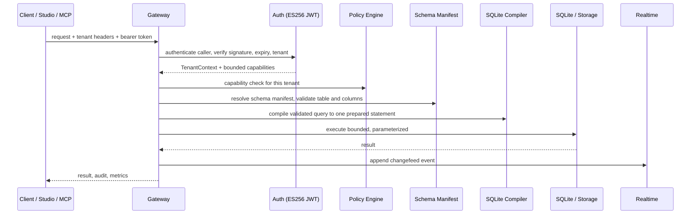

<div align="center">
  

  # Mekka

  **KEEP THE BACKEND. FIRE THE FLEET.**

  Database, Auth, Storage, Realtime, Studio, and safe agent access in one Bun project.

  [](https://github.com/yiaany/mekka/actions/workflows/ci.yml)
  
  
  
  
  
</div>

`bun sqlite` · `jose/jwks` · `better-auth` · `supabase-js` subset · `preview branches` · `studio`

Run this:

```bash
npx mekka
```

Mekka downloads the project, installs it, builds the core, starts the backend, and opens Studio at
`http://127.0.0.1:8082`. You end up with a real database, user accounts, files, live updates,
previews, approvals, and MCP. No external database, no pile of containers.

<p align="center">
  
</p>

> **Current status:** this runs locally. Real deposits don't exist because there's no billing plane;
> it's a self-hosted backend you own. The agent-access and approval paths work against a local SQLite
> project today, and the libSQL/Turso and PGlite engines are still being built.

## Product tour

These screenshots come from the current project, not a design mockup.

<table>
  <tr>
    <td width="50%"></td>
    <td width="50%"></td>
  </tr>
  <tr>
    <td width="50%"></td>
    <td width="50%"></td>
  </tr>
  <tr>
    <td width="50%"></td>
    <td width="50%"></td>
  </tr>
</table>

**Table editor.** Typed reads and writes, columns, indexes, migrations, schema hashes, checkpoints,
backup, restore. **SQL editor.** One restricted statement per run, no system tables, hard LIMITs.
**Auth users.** Sessions, email verification, password reset, OAuth. **Auth providers.** Google and
GitHub. **Agent Access.** One-hour scoped tokens, preview-bound writes, approval.

Studio contains code derived from Supabase Studio under Apache License 2.0. Provenance and the
reproduced license live in [`apps/studio/UPSTREAM.md`](apps/studio/UPSTREAM.md) and
[`apps/studio/UPSTREAM_LICENSE`](apps/studio/UPSTREAM_LICENSE).

## Why Mekka exists

Supabase taught the market to expect a database, Auth, Storage, Realtime, and a dashboard in the same
box. Fine. Mekka keeps that product shape and cuts the infrastructure bill underneath it. The current
release runs on Bun and SQLite. The database is a file you own. Studio ships in the repo. You can
trace the request path without drawing a map of twelve services first.

The whole backend runs on one process with a bounded request budget. Every request carries the full
tenant identity and every user value stays a prepared-statement parameter. That's the contract:

| Concern | Bound into each request |
| --- | --- |
| Who is calling | Authed caller with a capability set, tenant tuple must match headers exactly |
| Where the money and data can go | One organization, project, environment, branch, generation |
| What it can touch | Type-resolved tables and columns from the schema manifest |
| How big it can be | Row cap, request byte cap, response byte cap, object cap, timeouts |
| Replay safety | SHA-256 fingerprint and reusable idempotency keys |
| Writes from agents | Disposable preview branch, then one-time human-approved promotion |

Deep PostgreSQL compatibility still belongs on PostgreSQL. Mekka rejects unsupported behavior instead
of faking it. Teams that need native RLS, stored procedures, ranges, or a large extension catalog
should use the real thing. Everyone else has been paying a Postgres tax for features their app never
touches.

> **Mekka is coming for the teams that want Supabase's product and none of its weight.**

## How it compares

| | Mekka | Supabase | DIY on Postgres |
| --- | --- | --- | --- |
| Auth, Storage, Realtime, dashboard in one box | Yes | Yes | You build it |
| Runs on one process, one file | Yes, Bun + SQLite | No, a fleet of services | No, a stack of containers |
| Safe agent writes via preview branches | Yes, scoped tokens + approval | Some branch support | You build it |
| Prompts/tools stay off production roulette | Yes, single Studio approval | Partial | You build it |
| Supabase-js data subset for common CRUD | Yes, tested | Native | You write the adapter |
| Works against a checked-out repo offline | Yes | No | No |
| Native Postgres RLS, RPC, extensions | No, explicit error | Yes | Yes |
| Local infrastructure cost | One Bun process | Cloud services | Containers, ops |

The compatibility claim stops where the tests stop. Arrays, ranges, native PostgreSQL RLS, RPC,
arbitrary extensions, casts, and the full PostgREST surface are not supported today.

Read the exact contracts:

- [Data API compatibility](apps/gateway/SUPABASE_DATA_COMPATIBILITY.md)
- [Gateway compatibility](apps/gateway/COMPATIBILITY.md)
- [SQLite management API](apps/sqlite-meta/COMPATIBILITY.md)
- [Realtime protocol](docs/realtime-protocol-matrix.md)
- [Core capability matrix](docs/core-capability-matrix.md)

## Request path



Auth happens before permissions. The backend resolves table and column names through the schema
manifest, binds user values as parameters, applies policy, and executes one prepared statement. It
never parses user SQL directly; the constrained query dialect becomes an AST first, then a compiled
statement, then a bounded execution. The whole read path stays inside one transaction or one timeout.

Mutations carry idempotency keys. Payloads, results, uploads, queues, and Realtime buffers have hard
limits. Unsupported operations return an explicit error instead of an approximation. Errors don't
carry secrets, SQL values, or stack traces.

## Agent writes without production roulette

An AI agent should not need your production database password. Mekka gives it a short-lived token
bound to one organization, project, environment, branch, generation, and application session. Read
access works immediately. Write access opens a disposable preview.

```text
Agent
  -> one-hour scoped token
  -> isolated preview branch
  -> migration and validation
  -> exact SQL approval in Studio
  -> one-time production promotion
```

Mekka stores the migration artifact, SQL, schema hashes, and destructive-operation flag. Studio shows
the change before approval. The approval secret works once and only for that artifact. Promotion
checks the production schema again before it runs. The agent can break its preview; production stays
behind a human decision and a schema check.

The MCP surface is deliberately small:

| Kind | Name | What it does |
| --- | --- | --- |
| Resource | `schema://current` | Current schema manifest |
| Resource | `schema://branch/{branchId}` | Schema for the matching branch only |
| Resource | `policies://current` | Sanitized policy summary, no executable predicates |
| Resource | `migrations://history` | Migration metadata, no SQL text |
| Resource | `logs://recent` | Log metadata, message text marked untrusted |
| Resource | `capabilities://session` | Capabilities active for this session |
| Tool | `inspect_schema` | Read the branch schema manifest |
| Tool | `explain_query` | Compile a constrained read query without executing it |
| Tool | `list_migrations` | Applied migration metadata |
| Tool | `get_policy_summary` | Sanitized policy summary |
| Tool | `create_preview_branch` | Short-lived isolated preview from the parent |
| Tool | `propose_migration` | Record a branch-bound migration plan, no DDL applied |
| Tool | `apply_to_preview` | Apply the proposal to its exact preview only |
| Tool | `validate_changes` | Validate the applied preview migration |
| Tool | `request_promotion` | Ask Studio for approval, then step up |

There is no direct production-write tool, no arbitrary SQL, no row-data access, no credential or
token passthrough. Each tool is gated by a separate capability (`mcp:read`, `mcp:preview:create`,
`mcp:preview:propose`, `mcp:preview:apply`, `mcp:preview:validate`, `mcp:promotion:request`).

<details>
<summary><strong>MCP configuration</strong></summary>

```json
{
  "mcpServers": {
    "mekka": {
      "type": "http",
      "url": "https://mekka.example.com/mcp",
      "headers": {
        "Authorization": "Bearer <temporary-agent-access-token>"
      }
    }
  }
}
```

For a local MCP server that bridges stdio to the remote Streamable HTTP endpoint:

```bash
npx mekka mcp-stdio --url https://mekka.example.com/mcp --token-env MEKKA_MCP_TOKEN
```

</details>

## API surface

Everything below runs through the gateway. The tenant tuple
`organization / project / environment / branch / generation` gates every request.

### Data API

| Method | Path | Notes |
| --- | --- | --- |
| GET/POST/PATCH/DELETE | `/rest/v1/:table` | Policy-authorized select and mutate |
| ALL | `/mcp` | MCP Streamable HTTP endpoint |
| GET | `/openapi.json` | Static OpenAPI 3.1 document |

Subsets supported from `supabase-js`: `select`, `eq`/`neq`/`gt`/`gte`/`lt`/`lte`/`in`/`is`/`not`/`or`/`match`,
`order`, `limit`, `range`, exact `count`, `insert`, `update`, `delete`, `upsert` (primary key only,
merge duplicates only). Embedding, aliases, casts, RPC, arrays, ranges, and full-text search fail
explicitly.

### Storage

| Method | Path | Notes |
| --- | --- | --- |
| GET/POST/PATCH/DELETE | `/storage/v1/buckets` | List, create, read, update, delete |
| GET/PUT/DELETE | `/storage/v1/object/:bucket/*` | List, upload, download, delete |
| POST | `/storage/v1/object/sign/:bucket/*` | Issue a signed read grant |
| GET | `/storage/v1/signed/:bucket/*` | Redeem a signed grant |
| POST/HEAD/PATCH/DELETE | `/storage/v1/resumable/:uploadId` | Resumable upload subset with leases |

Local filesystem and S3-compatible providers, checksummed bounded reads, MIME allowlisting, quotas,
and reconciliation. Full TUS, transforms, and multipart uploads are not claimed.

### Realtime

| Surface | Notes |
| --- | --- |
| WebSocket | `/realtime/v1/websocket`, idle timeout, bounded payload |
| Changefeeds | Transactional SQLite journal, resume cursor, policy-projected delivery |
| Channels | Private channels, Broadcast, Presence |

### Schema, Auth, and agent endpoints (local backend)

| Method | Path | Capability |
| --- | --- | --- |
| GET | `/tables`, `/tables/:table` | `schema:read` |
| GET | `/rows/:table` | `data:read`, filtered, paginated |
| POST/PATCH/DELETE | `/rows/:table` | `data:write`, idempotent |
| POST | `/sql` | One restricted statement |
| POST/PATCH/DELETE | `/tables`, `/tables/:table` | `schema:manage`, checkpointed |
| GET/POST | `/columns`, `/indexes` | Schema read and manage |
| GET | `/schema/health` | Format, schema version, schema hash |
| ALL | `/auth/*` | Local auth |
| POST | `/auth-local/agent-token` | Issue an Agent Access token |
| GET/PATCH | `/mcp-admin/approvals` | Review and decide approvals |
| ALL | `/mcp` | MCP endpoint |

## Security model

| Boundary | What Mekka does |
| --- | --- |
| Tenant isolation | Exact five-part tuple in headers or signed-url query params; mismatch fails before policy |
| Access tokens | ES256 JWT, JWKS exposed, verifier applies clock tolerance and short expiry |
| Sessions | HttpOnly cookie, refresh that rotates |
| Auth | `better-auth` with email OTP, password reset, Google and GitHub OAuth |
| Injection | User values always prepared-statement parameters, never interpolated |
| Replay | SHA-256 request fingerprint, reusable idempotency keys, conflict on reuse with different body |
| Agent writes | Preview branch only, schema CAS on promotion, one-time approval, no production SQL tool |
| MCP | No credential or token passthrough, no row data, logs and prompts marked untrusted |
| Storage | Signed read grants with TTL, checksums, bounded objects, resumable leases with cleanup |
| Errors | No secrets, SQL values, or stack traces; stable category codes |
| Infrastructure | Backend stays on loopback behind a TLS reverse proxy; secrets mounted at runtime |

Security research is welcome. Source access makes review possible; it doesn't prove the absence of
vulnerabilities.

## Start locally

Install Node.js 20 or newer, then run:

```bash
npx mekka
```

Choose a folder name if `mekka` is already taken:

```bash
npx mekka my-app
```

The CLI installs Bun when needed. Git is optional; without it, Mekka downloads the GitHub archive
over HTTPS. The bootstrap enforces limits on archive size, extracted bytes, and entry count.

Inside an existing checkout:

```bash
bun install --frozen-lockfile
bun run dev
```

| Service | Address |
| --- | --- |
| Studio | `http://127.0.0.1:8082` |
| Backend | `http://127.0.0.1:3001` |

Local state stays in `apps/studio/.local/`.

## Self-hosting

Build the repository, set the server secrets, and start Studio:

```bash
bun run build

MEKKA_STUDIO_ACCESS_TOKEN="replace-with-a-random-token" \
MEKKA_AUTH_SESSION_SECRET="replace-with-a-random-secret" \
MEKKA_PUBLIC_URL="https://mekka.example.com" \
NEXT_PUBLIC_SITE_URL="https://mekka.example.com" \
SQLITE_META_DATA_DIRECTORY="/absolute/path/to/mekka-data" \
bun run --cwd apps/studio start:production
```

The backend stays on loopback. Put a trusted TLS reverse proxy in front of Studio and persist the
data directory. Run a restore before trusting a backup.

Docker builds are available:

```bash
docker build \
  --build-arg NEXT_PUBLIC_SITE_URL=https://mekka.example.com \
  --build-arg NEXT_PUBLIC_MEKKA_GATEWAY_URL=https://mekka.example.com \
  -f apps/studio/Dockerfile \
  -t mekka-studio .
```

## Verification

The main branch checks Bun, TypeScript, lint, workspace tests, Studio tests, the CLI, the production
smoke path, and the health service.

```bash
bun run check
```

That runs formatting, lint, typecheck (core and Studio), the CLI test suite, workspace tests,
Studio tests, the production build, and the smoke tests in one gate.

## What ships today

| Ready now | Still being built |
| --- | --- |
| SQLite engine with typed Data API | libSQL/Turso remote databases and embedded replicas |
| Auth: sessions, JWT/JWKS, OAuth, refresh | PGlite isolated runtimes, JSONB, pgvector |
| Storage: local and S3 providers, signed grants | Managed preview databases and primary write routing |
| Realtime changefeeds, Broadcast, Presence | Distributed Realtime coordinator |
| Preview branches with guarded promotion | Divergent data merge and multiple dependent migrations |
| Scoped agent access with Studio approvals | Embedded OAuth issuer for MCP |
| Studio, SQL editor, users, providers, files | Functions module provisioning and an edge runtime |
| Supabase-js data subset, tested | Full PostgREST parity items |
| Health service and smoke suite | Production monitoring, backup drills, incident runbooks |

Mekka is ready for a controlled local deployment with test data. It isn't ready to absorb a paid
cloud's production workload; the engine track through libSQL and PGlite has to land and pass its
storage, migration, branch, security, and failure tests first.

## Repository map

| Path | Purpose |
| --- | --- |
| `apps/gateway` | Data, Storage, Realtime, compatibility, MCP mount |
| `apps/sqlite-meta` | Database management, Auth, branches, approvals, local MCP |
| `apps/mcp` | Agent resources, tools, and mutation workflow |
| `apps/studio` | Studio and production web server |
| `apps/health-service` | Health check example |
| `packages/auth-core` | Sessions, JWT/JWKS, OAuth, token rotation |
| `packages/storage-core` | Database adapter and object storage |
| `packages/realtime-core` | Changefeeds, channels, Broadcast, Presence |
| `packages/branch-core` | Preview lifecycle and guarded promotion |
| `packages/migration-engine` | Migration artifacts, checkpoints, restore |
| `packages/policy-engine` | Row and field authorization |
| `packages/schema-manifest` | SQLite schema contracts |
| `packages/sqlite-compiler` | Prepared SQLite statement compiler |
| `packages/query-ast` | Validated Data API queries |
| `packages/protocol` | Tenant identity, capabilities, errors |
| `packages/studio-domain-sdk` | Typed Studio API client |
| `packages/mekka-cli` | The `npx mekka` launcher and `mcp-stdio` bridge |
| `packages/onboarding-core` | Project provisioning and connect analyzer |
| `apps/studio/UPSTREAM.md` | Supabase Studio provenance |

## Development

Run the complete repository gate:

```bash
bun run check
```

| Command | Purpose |
| --- | --- |
| `bun run dev` | Build the Studio SPA, then start the low-memory Studio and backend runtime |
| `bun run --cwd apps/studio dev:hmr` | Start the memory-heavier Vite HMR server for Studio development |
| `bun run test` | Run the core Bun tests |
| `bun run test:workspaces` | Run workspace test suites |
| `bun run test:studio:fork` | Run Studio integration tests |
| `bun run lint` | Run Biome lint checks |
| `bun run typecheck` | Typecheck core packages |
| `bun run typecheck:studio` | Typecheck Studio |
| `bun run build` | Build packages and Studio |
| `bun run smoke:studio:production` | Test the production Studio path |
| `bun run smoke:health` | Test the health service |
| `bun audit` | Check dependency advisories |

Read [`CONTRIBUTING.md`](CONTRIBUTING.md) before opening a pull request.

## Support and security

Use GitHub Issues for reproducible bugs, questions, and feature requests. Report vulnerabilities
privately through the process in [`SECURITY.md`](SECURITY.md).

Mekka is under active development. Reviewed paths have tests. A production deployment still needs
monitoring, verified backups, deployment hardening, and an independent security review.

## License

Mekka uses the **Mekka Business License 2.0**. Individuals may inspect, modify, test, and learn from
the source. Qualifying small organizations may use Mekka in their products under the additional grant.

Large companies and cloud providers may not repackage Mekka as a competing hosted backend without a
commercial agreement. [`LICENSE.md`](LICENSE.md) contains the terms.

> **WE'RE BUILDING THE REASON TO LEAVE SUPABASE.**