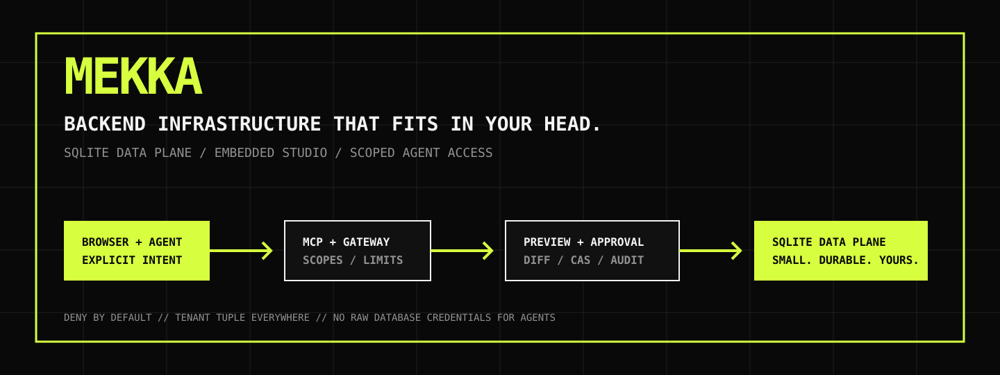

<div align="center">
  

  # MEKKA

  **BACKEND INFRASTRUCTURE THAT FITS IN YOUR HEAD.**

  SQLite data plane. Embedded Studio. Scoped Agent Access. No mystery meat control plane.

  [](https://github.com/yiaany/mekka/actions/workflows/ci.yml)
  
  
  
  
  

  [Quick start](#run-it) · [Architecture](#architecture) · [Agent Access](#agent-access) · [Security](#security) · [Commands](#commands)
</div>

<br />



---

## The Pitch

Mekka is a compact backend platform for teams that want the control surface of a modern BaaS
without assigning a dedicated PostgreSQL cluster to every project.

It bundles a SQLite-compatible data plane, Auth, Storage, Realtime, a private Studio fork,
Supabase-compatible Data API behavior, and an MCP surface designed for agents that should be
useful without being trusted blindly.

```text
organization / project / environment / branch / generation
```

That tuple follows every request, capability, cache key, branch, audit event, and authorization
decision. If identity or routing is ambiguous, Mekka rejects the operation.

## Why Mekka

| | **Mekka** | **Supabase** | **Plain SQLite** |
| --- | --- | --- | --- |
| Primary database | SQLite-compatible data plane | Full PostgreSQL database | SQLite file / embedded engine |
| Visual control surface | Bundled private Studio fork | Hosted and self-hosted Studio | Bring your own tooling |
| Agent protocol | Native MCP with tenant-bound capabilities | Official MCP with project and feature scopes | None built in |
| Default agent access | Read-only | Configurable; hosted MCP supports read-only mode | Application-defined |
| Write safety | Explicit Studio opt-in, isolated preview, exact-SQL approval, CAS promotion | Depends on MCP configuration and enabled feature groups | Application-defined |
| Agent credentials | Derived opaque token, maximum 5-minute TTL | Hosted OAuth or access-token based flows | Application-defined |
| Schema branches | Verified SQLite snapshots with replay-safe promotion | Platform branching is available; MCP branching is experimental | Manual file copies / custom workflow |
| API compatibility | Native typed API plus tested Supabase subset | Native Supabase APIs | None built in |
| Self-host shape | Bun/Node services plus SQLite state | Multi-service Postgres stack | Single embedded database |

> This is a product-shape comparison, not a benchmark or a parity claim. Mekka intentionally
> supports a narrower SQLite-native model. Supabase remains the reference for the compatible
> client subset and provides substantially broader PostgreSQL semantics.

Supabase comparison references: [Database](https://supabase.com/docs/guides/database/overview),
[MCP Server](https://supabase.com/docs/guides/ai-tools/mcp), and
[Self-hosting](https://supabase.com/docs/guides/self-hosting).

## Architecture

```text
  Developer / AI Agent
           |
           |  HTTPS + 5-minute opaque token
           v
  +-------------------------+
  |      MCP Gateway        |
  | body limits / rate limit|
  +------------+------------+
               |
               v
  +-------------------------+
  |     Token Verifier      |
  | session / tenant / TTL  |
  | default: mcp:read       |
  +------------+------------+
               |
      read ----+---- write opt-in
               |             |
               |             v
               |   +---------------------+
               |   | Isolated Preview DB |
               |   | plan / apply / test |
               |   +----------+----------+
               |              |
               |       exact SQL approval
               |              v
               |   +---------------------+
               +-->|     sqlite-meta     |
                   | manifest / compiler |
                   | ledger / audit      |
                   +----------+----------+
                              |
                              v
                   +---------------------+
                   |   SQLite Database   |
                   | prepared statements |
                   +---------------------+
```

The normal query path is equally explicit:

```text
Client / Studio / MCP
  -> authentication
  -> rate and size limits
  -> tenant-bound capabilities
  -> typed query or migration artifact
  -> policy rewrite
  -> prepared SQLite statement
  -> storage adapter
  -> response, metrics, and audit
```

## What Ships

| Surface | Current capability |
| --- | --- |
| **Studio** | Table editor, SQL workspaces, Auth administration, Storage management, Agent Access, and MCP approvals. |
| **Data API** | Typed policy-rewritten reads and mutations, bounded pagination, durable idempotency, and selected Supabase-compatible behavior. |
| **SQLite management** | Tables, columns, indexes, rows, constrained SQL, migrations, schema diff, checkpoints, backup, and restore. |
| **Auth** | Email/password, hashed OTP verification, sessions, JWT/JWKS, refresh rotation, password reset, OAuth, and admin audit. |
| **Storage** | Buckets, local/S3 providers, signed reads, resumable uploads, quotas, and reconciliation. |
| **Realtime** | Changefeed subscriptions, private channels, broadcast, presence, payload limits, and policy-aware delivery. |
| **Branching** | Schema-only preview snapshots, migration validation, restore points, CAS promotion, and retry recovery. |
| **MCP** | Read tools by default; opt-in preview mutations with exact-SQL Studio approval before production promotion. |

## Agent Access

Agent access is deliberately split into two modes.

### Read-only by default

- Studio issues a separate opaque Agent Access token, never the application refresh token.
- The token lives for at most five minutes and is stored server-side only as an HMAC digest.
- The grant is bound to the complete tenant tuple and the originating auth session.
- Logout, password reset, expiry, or session deletion invalidates access.
- Default capability: `mcp:read`.

### Read-write only after explicit consent

The user must enable **read-write MCP** in Studio before generating the token. That token is bound
to a newly created isolated preview branch and receives only the mutation scopes required for the
guarded workflow:

```text
mcp:preview:propose
mcp:preview:apply
mcp:preview:validate
mcp:promotion:request
```

The preview token never receives production execute scope. A production mutation requires:

1. A migration proposal bound to the preview tenant and current parent schema hash.
2. Successful application and validation against the isolated preview database.
3. A durable Studio approval containing the exact SQL and destructive-operation flag.
4. An explicit user decision that issues a short-lived, one-time execution secret bound to the
   approval, actor, proposal, artifact, parent schema, preview schema, and tenant.
5. Atomic consumption of that execution secret while the approval remains unexpired.
6. A final authorization-expiry and schema CAS check inside the production mutation lock.

An agent typo can damage its disposable preview. It cannot silently rewrite production.

Universal MCP configuration:

```json
{
  "mcpServers": {
    "mekka": {
      "type": "http",
      "url": "https://mekka.example.com/mcp",
      "headers": {
        "Authorization": "Bearer <temporary-agent-access-token>"
      }
    }
  }
}
```

## Run It

### Requirements

- Bun `1.3.14`
- Git
- A current Chromium, Firefox, or Safari browser

```bash
git clone https://github.com/yiaany/mekka.git
cd mekka
bun install --frozen-lockfile
bun run dev
```

Open `http://127.0.0.1:8082`.

| Service | Address | Purpose |
| --- | --- | --- |
| Studio | `http://127.0.0.1:8082` | Browser control surface and same-origin API |
| sqlite-meta | `http://127.0.0.1:3001` | Project data, Auth, branches, approvals, and MCP backend |

Local runtime state lives under `apps/studio/.local/` and is ignored by Git and Docker contexts.

## Production

Required server-side configuration:

| Variable | Purpose |
| --- | --- |
| `MEKKA_STUDIO_ACCESS_TOKEN` | Protects the Studio production server; minimum 24 characters. |
| `MEKKA_AUTH_SESSION_SECRET` | Auth and Agent Access HMAC secret; minimum 32 random characters. |
| `MEKKA_PUBLIC_URL` | Public origin used by Auth and MCP metadata. |
| `NEXT_PUBLIC_SITE_URL` | Public browser origin baked into the Studio build. |
| `SQLITE_META_DATA_DIRECTORY` | Absolute persistent data directory. |
| `MEKKA_RESEND_API_KEY` | Server-only production email credential. |
| `MEKKA_AUTH_EMAIL_FROM` | Verified Auth email sender. |

```bash
bun run build

MEKKA_STUDIO_ACCESS_TOKEN="replace-with-a-random-token" \
MEKKA_AUTH_SESSION_SECRET="replace-with-a-random-secret" \
MEKKA_PUBLIC_URL="https://mekka.example.com" \
SQLITE_META_DATA_DIRECTORY="/absolute/path/to/mekka-data" \
bun run --cwd apps/studio start:production
```

The launcher creates an additional random internal proxy credential shared only by Studio and
sqlite-meta. Backend listeners remain loopback-only. Terminate TLS at a trusted reverse proxy,
persist the data directory, and test restores before storing valuable data.

### Docker

```bash
docker build \
  --build-arg NEXT_PUBLIC_SITE_URL=https://mekka.example.com \
  --build-arg NEXT_PUBLIC_MEKKA_GATEWAY_URL=https://mekka.example.com \
  -f apps/studio/Dockerfile \
  -t mekka-studio .
```

## Security

- Authentication happens before authorization.
- Authorization compares the full tenant tuple, including generation.
- Read-write Agent Access is opt-in and preview-bound; read is the default.
- Raw Agent tokens, refresh tokens, SQL values, secrets, and provider credentials are not logged.
- User values use prepared parameters; identifiers resolve through the schema manifest.
- Public SQL is constrained to one statement and a small allowlisted subset.
- SQL writes and structured mutations commit with durable idempotency and audit-outbox records.
- Mutation request bodies, MCP messages, query rows, and responses are bounded.
- Destructive schema changes require a verified checkpoint.
- Production promotion consumes an artifact-bound step-up secret and rechecks its expiry inside the
  mutation lock.
- Unexpected errors become stable sanitized envelopes without stack traces.

See [`SECURITY.md`](SECURITY.md) for private vulnerability reporting and
[`docs/runbooks/`](docs/runbooks/) for operational recovery procedures.

## Commands

| Command | Purpose |
| --- | --- |
| `bun run dev` | Start local Studio and sqlite-meta. |
| `bun run test` | Run the core Bun test matrix. |
| `bun run test:workspaces` | Run compatible workspace suites. |
| `bun run test:studio:fork` | Run Mekka-specific Studio integration assertions. |
| `bun run lint` | Run Biome lint checks. |
| `bun run typecheck` | Typecheck core project references. |
| `bun run typecheck:studio` | Typecheck Studio and generated route contracts. |
| `bun run build` | Build core packages and production Studio. |
| `bun run smoke:studio:production` | Exercise packaged Studio, Auth, SQLite, read/write MCP, approval, and promotion. |
| `bun audit` | Check the installed dependency graph for known advisories. |
| `bun run check` | Run the complete release gate. |

## Repository Map

```text
apps/
  gateway/             REST, Storage, Realtime, Supabase compatibility, MCP mount
  health-service/      Independent health-service example
  mcp/                 Resources, tools, transport, scopes, mutation workflow
  sqlite-meta/         SQLite management, Auth, branches, approvals, Agent grants
  studio/              React control surface and production server

packages/
  auth-core/           Sessions, JWT/JWKS, OAuth, refresh rotation
  branch-core/         Preview lifecycle and guarded promotion
  migration-engine/    Migration artifacts, checkpoints, apply and restore
  policy-engine/       Row and field authorization
  protocol/            Tenant identity, capabilities, errors
  query-ast/           Validated Data API query representation
  realtime-core/       Changefeed, subscriptions, channels, presence
  schema-manifest/     Stable SQLite schema contracts
  sqlite-compiler/     Prepared statement compiler
  storage-core/        SQLite adapter and object storage
  studio-domain-sdk/   Typed Studio/backend boundary
```

## Compatibility

Compatibility is tested, never assumed. Mekka implements a selected `supabase-js` Data API subset
and returns explicit errors for unsupported PostgreSQL behavior. SQLite semantics are not presented
as parity for arrays, ranges, native PostgreSQL RLS, extensions, casts, or every PostgREST feature.

- [`apps/gateway/SUPABASE_DATA_COMPATIBILITY.md`](apps/gateway/SUPABASE_DATA_COMPATIBILITY.md)
- [`apps/sqlite-meta/COMPATIBILITY.md`](apps/sqlite-meta/COMPATIBILITY.md)
- [`apps/studio/UPSTREAM.md`](apps/studio/UPSTREAM.md)

Mekka Studio contains code derived from Supabase Studio under Apache License 2.0. Upstream
provenance and the reproduced license remain in `apps/studio/UPSTREAM.md` and
`apps/studio/UPSTREAM_LICENSE`.

## Status And License

Mekka is under active development. Passing tests are evidence for reviewed paths, not a promise of
zero future defects or a substitute for deployment hardening, monitoring, backups, and independent
security review.

The repository is source-available under the **Mekka Business License 2.0**. This is not an
OSI-approved open-source license. See [`LICENSE.md`](LICENSE.md) for the controlling terms.
